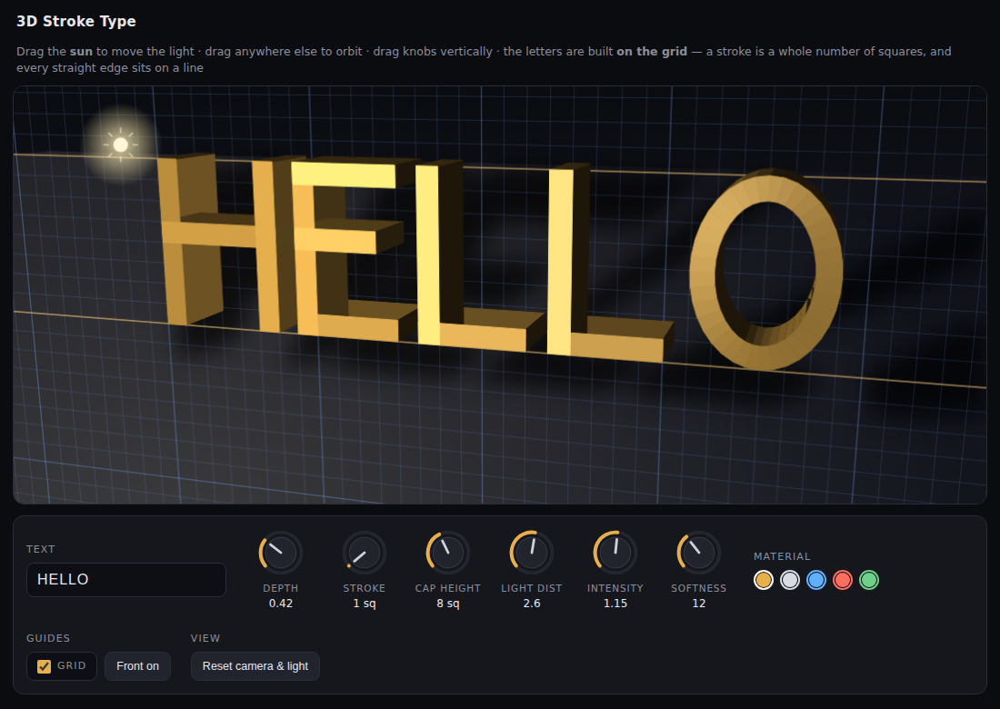
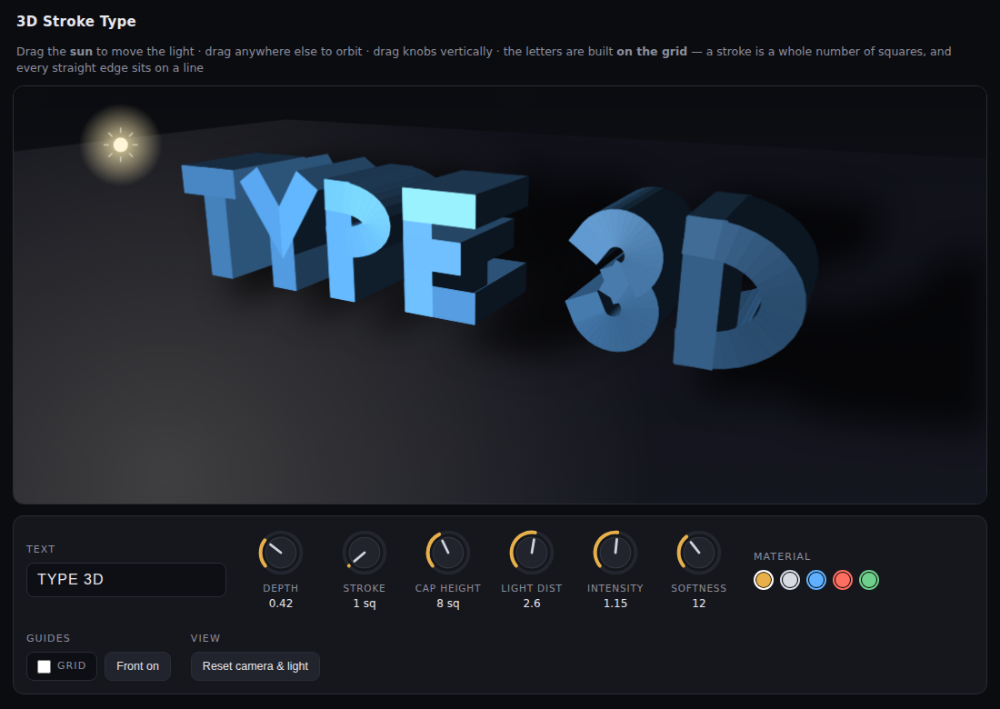
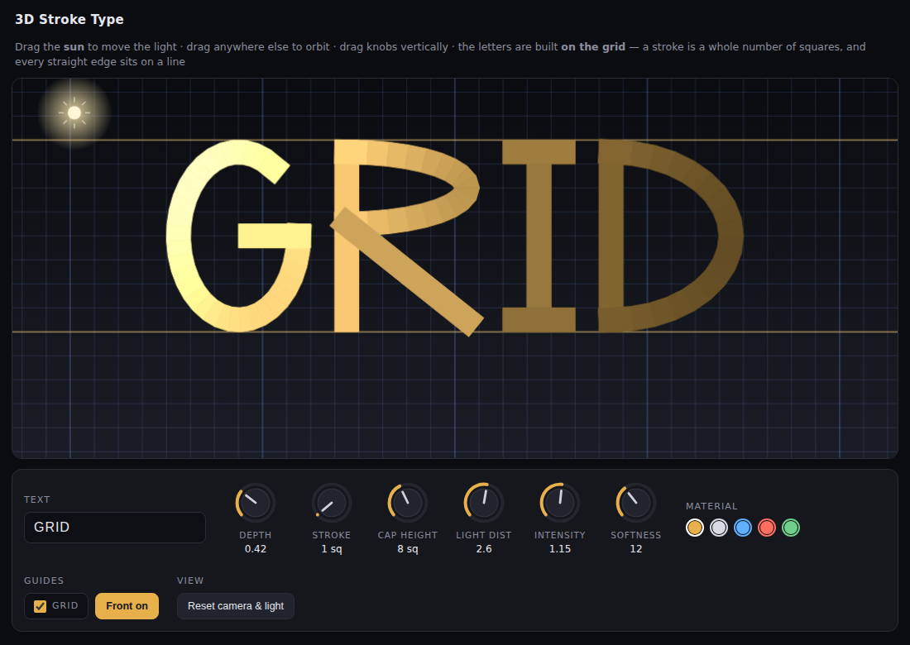

# 3D Stroke Type

An interactive toy that renders whatever you type as extruded 3D letters built
from a hand-authored stroke font — straight lines wherever a letter can be made
of them, arcs only where the shape genuinely needs one (S, O, C, G, Q, U, and
most digits). Depth and boldness are on knobs, and the light source is a sun you
drag around the canvas; it relights the faces and moves the shadow on the floor.

**Live demo: https://etoulas.github.io/research/3d-text-lighting/**

No libraries, no font files, no WebGL — one 2D canvas and about 600 lines of JS.

## Using it

| Control | What it does |
| --- | --- |
| **Text** field | Up to 24 characters, A–Z, 0–9 and `. , ! ? - + : ' / * #` (lowercase is upper-cased) |
| **Depth** knob | Extrusion along z, from flat to 1.4 cap-heights |
| **Stroke** knob | Stroke width in whole squares, 1–6 (capped at half the cap height) |
| **Cap height** knob | Squares per cap height, 4–14 — this *is* the design grid, so it redraws the letters |
| **Light dist** knob | Dollies the lamp toward or away from the viewer, keeping it visually in place |
| **Intensity** knob | Brightness of the point light, and how dark the shadow reads |
| **Softness** knob | Shadow blur |
| **Drag the sun** | Moves the light in the plane at its current distance |
| **Drag elsewhere** | Orbits the camera (yaw and pitch) |
| **Material swatches** | Base colour |
| **Grid** checkbox | Show the squared-paper guides (on by default) |
| **Front on** | Squares up head-on and switches to a near-orthographic projection |

Knobs respond to vertical drags, the scroll wheel, and double-click to reset.
Hold shift while dragging for fine control.

## How it works

**The font** (`font.js`) is generated from the grid, not drawn on top of it.
Every glyph is a builder function of two integers: `H` squares per cap height and
`N` squares of stroke width. Strokes are described by their *centre* lines and
the extruder gives each one a half-width of `N/2` with square caps — so a centre
line at `x = N/2` produces a stroke spanning exactly `[0, N]`, both edges on grid
lines, `N` squares apart. That single fact gives the metrics every glyph is built
from:

- `x0 = N/2`, `x1 = W - N/2` — stems whose outer edges are the glyph's 0 and W
- `y0 = N/2`, `y1 = H - N/2` — bars sitting exactly on the baseline and cap line
- `mid = ceil((H-N)/2) + N/2` — a middle bar with both edges on lines
- `sc(c) = round(c - N/2) + N/2` — snaps any other centre line so its two edges
  land on lines (T's stem, Y's stem, M's and W's vertices, 1, 4 …)

So the E's stem sits on the lines at 0 and N, its inner edge on the next line up;
its top bar's upper edge *is* the cap line and its bottom bar's lower edge *is*
the baseline. Glyph width is `round(H × ratio)` squares, advance is `W + 1`, and
the word is laid out from a whole-square offset so the phase holds across the
whole line.

Diagonals and curves can't have their long edges on lines — no straight diagonal
does, and no ellipse does. They're pinned the way you'd pin them on paper
instead: end points on lattice points, and every bowl's extremes touching the
glyph's bounding lines.

Glyphs are emitted as polyline *chains*, each arc kept as one chain (closed for a
full ellipse) so the extruder can miter its joints.

**Extrusion** (`extrudeChain` in `app.js`). A
chain is offset by ±half-width at every vertex along the angle bisector, scaled
by `1/cos(half-angle)` and clamped to 3× the half-width so a hairpin can't spike
off into space. Open chains get square caps by pushing their endpoints out by
the half-width first — that's what makes separate strokes fuse where they butt,
as in the crossbar of an A. Each resulting quad is extruded to a prism spanning
`z ∈ [-depth/2, +depth/2]`: 8 vertices, 6 quad faces, each carrying its own
analytic normal.

**Rendering.** Painter's algorithm on a 2D canvas. Faces are back-face culled
against the true eye position (using the stored normal, so winding order doesn't
matter), clipped against the near plane, sorted by camera-space depth and filled
far-to-near. Overlapping prisms at a joint are harmless because every face is
opaque. Each face is filled *and* stroked in its own colour so antialiasing
doesn't leave bright cracks between coplanar prisms.

**Lighting** is a point light evaluated in world space: ambient + Lambert
diffuse + a Blinn-style specular highlight, with a mild distance falloff. The
same light position drives the pool of light on the floor.

**Shadows.** Each prism's 8 corners are projected from the light onto the floor
plane `y = -0.45`; the convex hull of the projected points is the prism's
shadow. Perspective projection of coplanar points is a projective map, so the
hull can be taken after projecting to screen. All hulls are drawn as solid black
onto an offscreen canvas, then composited once with `globalAlpha` and a CSS blur
— that way overlapping shadows don't stack into a black blob, and the edges come
out soft for free.

**The grid.** The guides are drawn in the plane of the letter *fronts*
(`z = depth/2`), after the shadow and before the type, so the faces sit exactly
on the paper and the letters occlude the lines behind them. It's ruled in
cap-height units — `Squares` per cap height, a heavier line every whole cap
height, and the baseline and cap line marked in the accent colour, which are the
two rules you'd draw first on paper.

Sizing it to the canvas needs the inverse projection onto a plane of constant z.
That comes out in closed form: the camera transform is linear and the
perspective divide is linear-fractional, so substituting `u = a(D-w)`,
`v = b(D-w)` reduces it to a 2×2 linear system in (x, y), solved at the four
canvas corners. The extent is clamped (the vanishing side of the plane runs to
infinity) and the cell size doubles if the line count would get silly.

**Front on** parks the camera 220 units back instead of 6.2, which is
orthographic for all practical purposes, and squares up to yaw 0 / pitch 0.
That matters: under perspective even a head-on view shows the side walls of
off-centre letters and the squares aren't uniform, so you can't measure against
them. Flat, cap height is exactly `Squares` squares anywhere on the canvas and
the letters are 1:1 with the grid. The floor and its shadow are skipped in this
mode — edge-on, they'd only smear over the squares under the baseline — but the
lamp still shades the faces and can still be dragged.

**Framing.** The focal length and screen centre are solved every frame from the
projected bounding box of the actual geometry, so no combination of depth,
boldness, orbit angle and text length can push the word off the canvas.

**The draggable light.** Converting a screen drag into a world-space move is
done by projecting the light plus a small ε in x and y, building the 2×2
Jacobian of the projection numerically, and inverting it. The same step, run as
a Newton iteration, is used to re-place the lamp after the view refits: the
light's position is remembered as a *fraction of the canvas*, not as a world
coordinate, so it stays where you put it when the text changes and the view
rescales.

## Files

- `index.html` — page, styling, knob and swatch markup
- `font.js` — the stroke font and its flattener
- `app.js` — extrusion, camera, renderer, shadows, grid, knob widget, interaction
- `notes.md` — working notes, including the bugs hit along the way
- `preview.png`, `preview-deep.png`, `preview-grid.png` — screenshots

## Checking the alignment

Alignment is verified rather than eyeballed: a headless check builds the
axis-aligned glyphs (`EFHILT.:-+`) at cap heights 4/6/8/11/14 crossed with
strokes of 1/2/3/5 squares, and asserts every prism vertex lands on a grid
intersection. Worst error across all 20 combinations is 3.6e-15 squares — float
noise. (The first run found 12 vertices off by 1e-4: `extrudeChain` used to turn
a zero-length chain into a stub by nudging the endpoint, which is how the dots in
`.` and `:` were built. They now build their square directly.)

## Known limitations

- Painter's algorithm, not a z-buffer, so pathological self-intersections
  between prisms could sort wrongly. In practice the letters are convex enough
  that it holds up.
- Letters don't shadow *each other* — the shadow is cast onto the floor only.
- The font is caps-only; unmapped characters are skipped.
- Only straight strokes can sit on the lines. Diagonals and curves are pinned at
  their end points and extremes — that's the best any grid drawing can do.
- Very large strokes on a small cap height run out of room for counters, so the
  stroke is capped at half the cap height.
